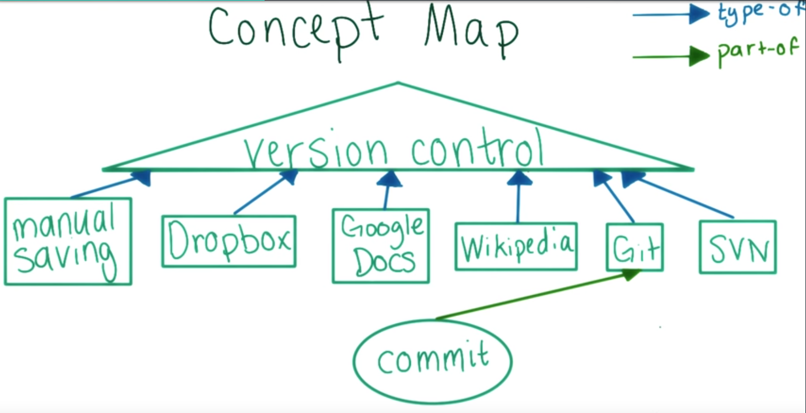
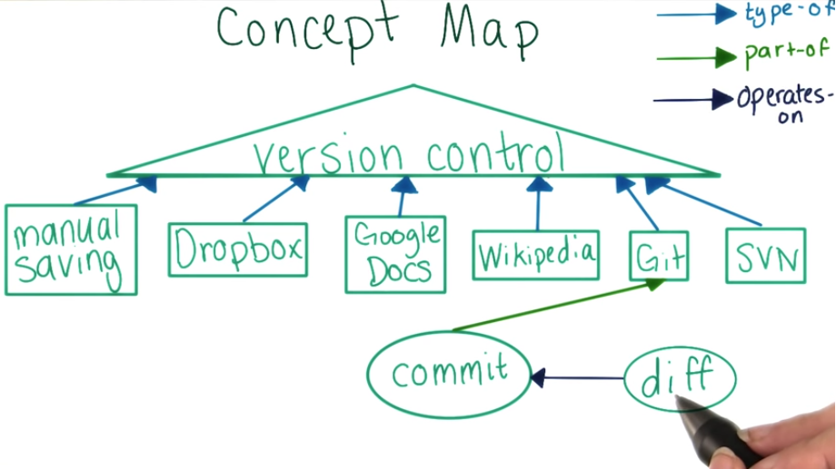

# How to Use Git and GitHub

## What we'll cover

* Lesson 1: why version control?
	* install `git` + read-only usage

* Lesson 2: read + write `git`

* Lesson 3: share + collaborate `GitHub`

## Asteroids Game

* [Doug's website](http://www.dougmcinnes.com/html-5-asteroids/)
* Using space to fire the engine might be more intuitive to usage

	Changing Control Keys
	Fire the engine: up arrow -> space
	Shoot: space -> enter

* game.js

```javascript
...
KEY_CODES = {
  32: 'space',
  37: 'left',
  38: 'up',
  39: 'right',
  40: 'down',
  70: 'f',
  71: 'g',
  72: 'h',
  77: 'm',
  80: 'p'
}
...
```

** Too long to find differences between old and new!! **

## Automatically Compare Files

* Windows - FC (file compare)
* Max - Diff (difference)
* Linux - Diff (difference)

## CMD

	// Windows
	// move to the folder where the files in
	uda> FC favorite-app-old.html favorite-app.html

	// Mac or Linux
	uda> diff - u favorite-app-old.html favorite-app.html

## Reflections

**How did viewing a diff between two versions help you spot the bug?**

### Why should I?

* This really helps!
* you'll use this content for vc prectice

### How?

* One file per lesson
* plain-text, Not rich-text

## Setup

[References](https://classroom.udacity.com/courses/ud775/lessons/2980038599/concepts/29975186190923#)

## Versions

- Saving manual copies
- Dropbox
- Google Docs
- Wikipedia

## Properties of a VCS for Code

**Feature Comparison Chart**

| Method        | Any Editor | Use Offline | Manual Save |
|---------------|------------|-------------|-------------|
| Manual Saving | Yes        | Yes         | Yes         |
| Dropbox       | Yes        | No          | No          |
| Google Docs   | No         | No          | No          |
| Wikipedia     | No         | No          | Yes         |
| Git           | Yes        | Yes         | Yes         |
| SVN           | Yes        | No          | Yes         |

## When to Save

		Q: As a programmer, when would you want to have a version of your code saved?
		A: Whenever there is a long pause in editing

## Commits

- fix off-by-one bug
- add cool new Feature
- improve user docs



## Using Git to View History

- TYPE ON CMD: git log

		::: OUTPUT :::
		commit 67190a32b8f8613bd83d364c56897aec37964844
		Author: jsong-pc <jsong00505@gmail.com>
		Date:   Mon Dec 26 23:00:35 2016 +0900

		feat: new project - puzzler

		made project and do some practices for the class

- TYPE ON CMD: git diff 67190a32b8f8613bd83d364c56897aec37964844 b126249b20a19fcb3769c7945f7c72f706dbbe2a

		::: OUTPUT :::
		diff --git a/README.md b/README.md
		index ebce37c..bb6ace5 100644
		--- a/README.md
		+++ b/README.md
		@@ -12,6 +12,8 @@ Checked list is completed to study:
		- [ ] class#2: [udacity-vr-nanodegree][udacity-vr-nanodegree-site]
		- [x] class#3: [udacity-writing-readmes][udacity-writing-readmes-site]
		- [ ] class#4: [udacity-intro-to-algorithms][udacity-intro-to-algorithms-site]
		+- [ ] class#5: udacity-intro-to-relational-databases
		+- [ ] class#6: udacity-how-to-use-git-and-github



## one Commit per Logical Change

### One Commit per Logical Change Solution

#### You commit all the changes required to add a new feature, which you’ve been working on for a week. You haven’t committed since you started working on it.

This commit seems too big. It's easier to understand what each commit does if each only does one thing and is fairly small. Going a week without committing is not the best idea.

#### You found three typos in your README. You fix and commit the first.

This commit seems too small. It would be better to fix all three typos, then commit. That way, your history won't get too cluttered with typo fixes. Plus, you don’t need to worry about introducing bugs to a README, so bundling changes together is more likely to be a good idea.

#### You commit all the changes required to add a new feature, which you’ve been working on for an hour.

This is probably a good size for a commit. All the work is on a single feature, so the commit will have a clear logical purpose. After an hour, the diff will probably have a fair amount of content in it, but not too much to understand.

On the other hand, sometimes after working for an hour you’ll have run into more than one natural committing point, in which case you would want to break the feature up into smaller commits. Because of this, “too big” could also be a reasonable answer here.

#### You fix two small bugs in different functions and commit them both at once.

This commit is probably too big. It would have been better to commit after the first bug fix, since the two bug fixes aren't related to each other.

### Judgment Call

Choosing when to commit is a judgment call, and it's not always cut-and-dried. When choosing whether to commit, just keep in mind that each commit should have one clear, logical purpose, and you should never do too much work without committing.
