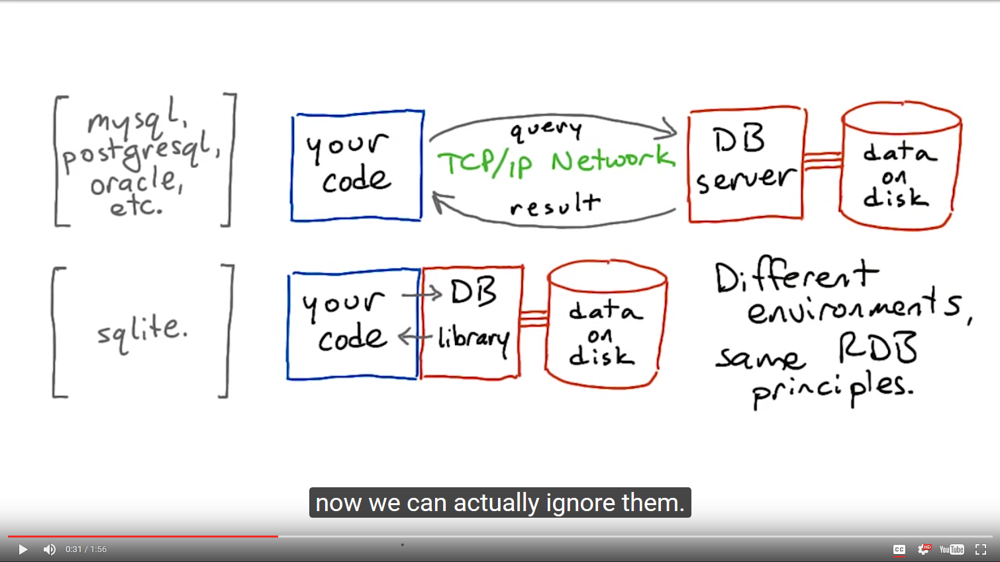
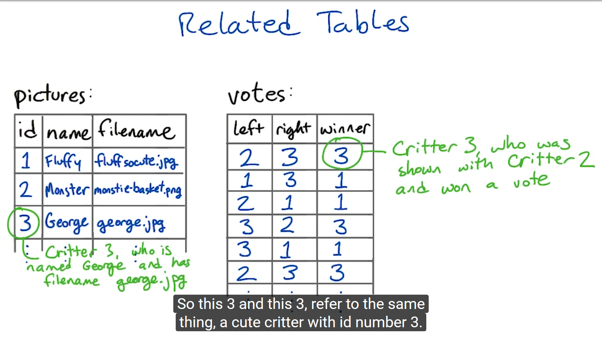
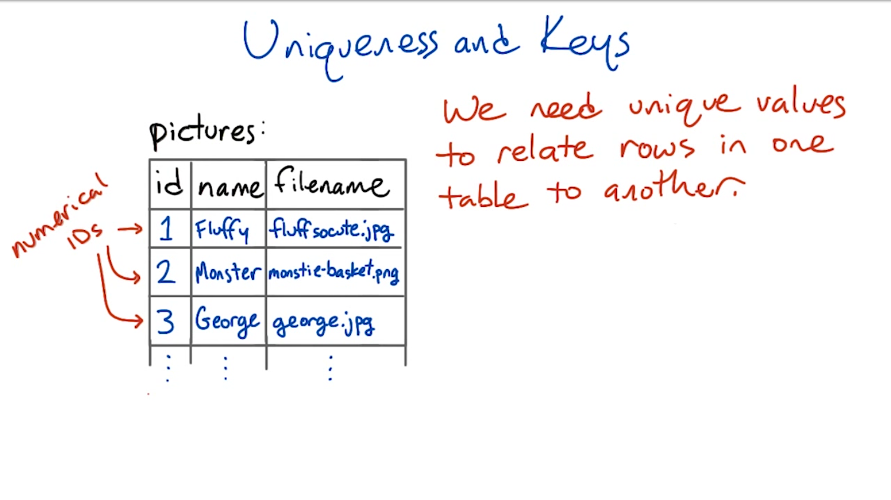
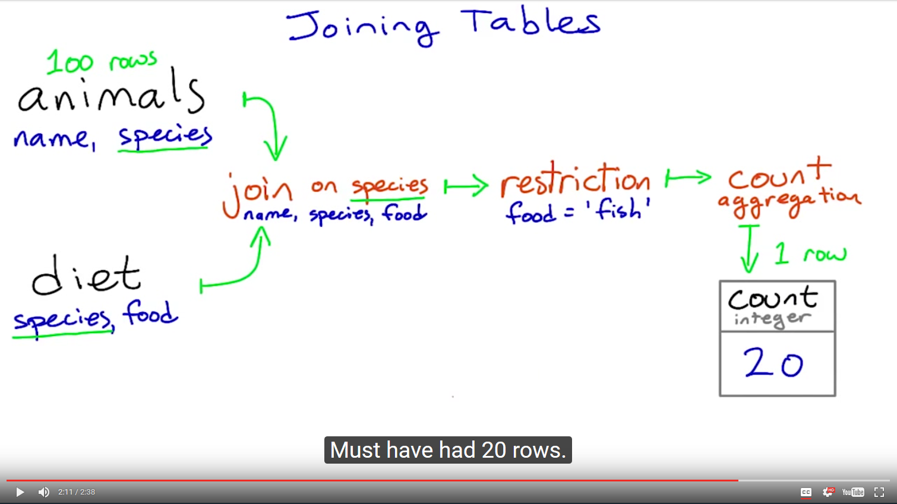

# Data and Tables

## What's a database, anyway?

How do we structure application data?

**In memory:**
- simple variables: numbers, strings
- data structures: lists, dictionaries, objects

** Durable Storage: **
- flat files on disk: text, XML, JSON

** databases **
 - key-value store
 - navigational DB
 - relational DB

** Relational database features: **
- persistent storage
- safe concurrent access by multiple programs/users <- All DBs
- flexible query language with aggregation and join operations
- constraints
- rules for protecting consistency of your data

## Aggregations

|  Question            |  Aggregation |
|----------------------|--------------|
| How many rows?       | count        |
| What's the average?  | avg          |
| What's the greatest? | max          |
| What's the least?    | min          |
| What's the sum?      | sum          |

## Table structure

`select food from diet where species = 'orangutan'`

** diet: **

| species(string) | food(string) |
|-----------------|--------------|
| llama           | plants       |
| brown bear      | fish         |
| brown bear      | meat         |
| brown bear      | plants       |
| orangutan       | plants       |
| orangutan       | insects      |

** diet: **

| species(string) | food1(string) | food2(string) | food3(string) |
|-----------------|---------------|---------------|---------------|
| llama           | plants        | -             | -             |
| brown bear      | fish          | meat          | plants        |
| orangutan       | plants        | insects       | -             |

** diet: **

| species(string) | food(string)       |
|-----------------|--------------------|
| llama           | plants             |
| brown bear      | fish, meat, plants |
| orangutan       | plants, insects    |

## How Queries Happen

zoo=> `select food from diet where species = 'orangutan';`

food
--------
plants
insects
(2 rows)

z==> `select 2+2;`

?column?
--------
4
(1 row)

z==> `select 2+2 as sum;``

sum
--------
4
(1 row)

## Related Tables

## Uniqueness and Keys
* name
* city name
* parking ticket

## Primary Key
* Student ID number
* Email address

## Joining Tables

** animals : **
- name(string)
- species(string)
- food(string)

** diet **
- species(string)
- food(string)

Query #1

      select animals.name, animals.species, diet.food
          from animals join diet
          on animals.species = diet.species;

Query #2

      select animals.name, animals.species, diet.food
          from animals join diet
          on animals.species = diet.species;

