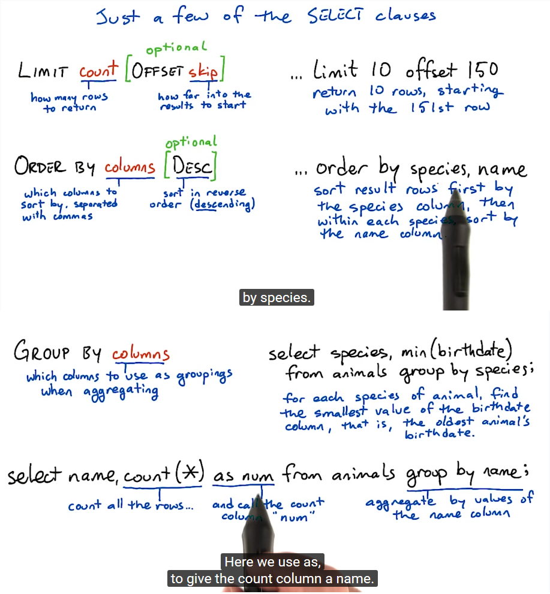

# Elements of SQL

## Select Clauses



## Why do it in the database?

| SQL clauses + aggregations  |Python list operations                    |
|-----------------------------|------------------------------------------|
| count(*) | Yes              | len(results)                             |
| Limit 100 offset 10         | results[10:110]                          |
| order by column             | sorted(results, key=lambda x: x[column]) |

The big differences are...
**SPEED->**
**SPACE**


## Insert: Adding Rows to a table

### To add a row:
**Insert into table values(42, 'stuff');**

### If the new values aren't in the same order as the table's columns:
**Insert into table (col2, col1) values ('stuff', 42);**

## Find the Fish-eaters

### Joining tables:
    select T.thing, S.stuff
      from T join S
      on T.target = S.match


## After Aggregating

### Which species does the zoo have only one of?

**WRONG:**
```
    select species, count(*) as num
      from animals group by species
      where num = 1;
```

The value of num comes from count and group by. But where always runs before aggregations.

**RIGHT:**
```
    select species, count(*) as num
      from animals group by species
      having num = 1;
```

**where** is a restriction on the source tables.
**having** is a restriction on the result... after aggregation!

## More Join Practice

I didn't get this, but not now. It was complicated just a little bit for me.
