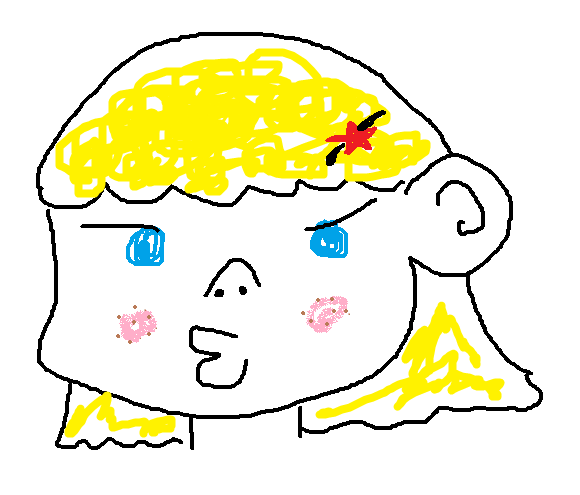

# Design Foundations, Ergonomics, and the Puzzler Projec
[<- Previous](README-4-1.md) ..... [Next ->](README-4-3.md)
## Who will be using my Puzzler project?
The people who interested in solve some ridiculous puzzles would love my VR app. That is because I really love to hide my purpose and that makes people surprise a lot. Also, I hope this app has thoughtful meaning so share how I think about making the world better on my own

*Answer:*

    Your end-users may vary, but my response to this question is:

    The end users for Puzzler are likely to be people who are new to VR, but who have already experienced various games in their life. They are probably going to be in their mid twenties and own a next-gen smartphone. And I hope they enjoy puzzle games!

## Persona

* age: 16
* Occupation: high school student
* Name: Eunsoo
* A quote: My jelly <3
* 2-3 sentences describing what motivates them: Eunsoo is one of normal little girl. She loves to watch soap dramas every day and have an awesome boyfriend. Her boyfriend loves to code so he tries to make her have an experience of VR.
* heir experience level with VR: very beginner

[Here is the link I posted](https://discussions.udacity.com/t/vr-persona-eunsoo/204592)

## A good statement of purpose

* Helps you understand what you are building
* Helps set the project scope
* Is one to two sentences
* Doesn't include any fluff

## Example statement of purpose
"**Constructor** is a **mobile AR application** which helps **ensure the safety** of **hands-on workers** by **visually alerting** them to **dangerous situations** in **real-time**"

* App name : **Constructor**
* Scope : **mobile AR application**
* Goals : Helps  **ensure the safety** of **hands-on workers**
* How: By **visually alerting** them to **dangerous situations** in **real-time**

## The purpose of Puzzler

    Puzzler is a mobile VR application for new VR users which challenges them to solve a familiar type of puzzle in a new way.

## Viewing Angles

**Make users comfortable!!!**

* Menu Button: left side of beneath the user's feet
* Back Button: right side of beneath the user's feet

*Answer:*

    Depending on how you want to create the application, it could go in many places. For me, I think that the horizontal stretch zone is a good spot. It’s relatively easy to find, but doesn’t get in the way of the front-and-center content. Another potential place would be just beneath the player - it would be a stretch, but it would never interfere with any of our content that way. The GVR Example UI uses this area.

## Personal bubble in VR starts

In VR starts, the personal bubble will be in one meter.

*Answer:*

    0.5 Meters is the general distance where people begin to feel uncomfortable. How close was your guess?

## Text

This text is hard to read on a mobile VR device.

**This thicker text is easier to read**

### This is bigger text is also easier to read

* 1 Unity Unit = 1 Meters
* Remember to test on device

## Sketch

**NEED TO DO!!!**

[<- Previous](README-4-1.md) ..... [Next ->](README-4-3.md)
